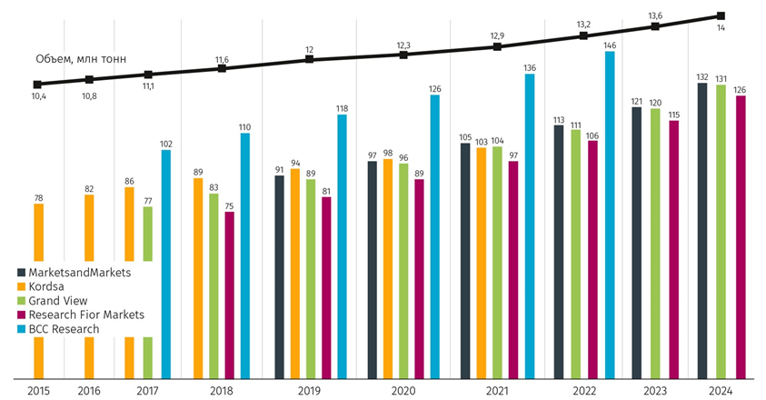
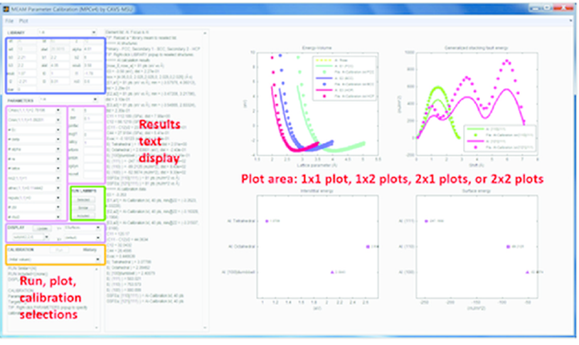
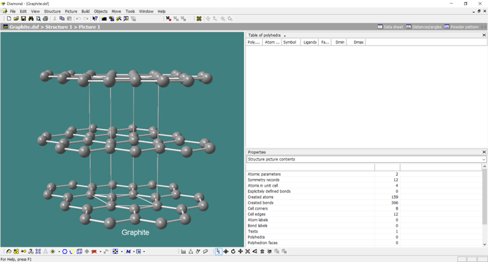
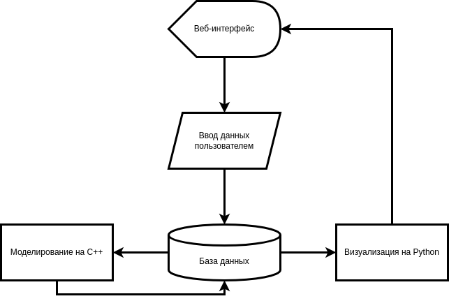
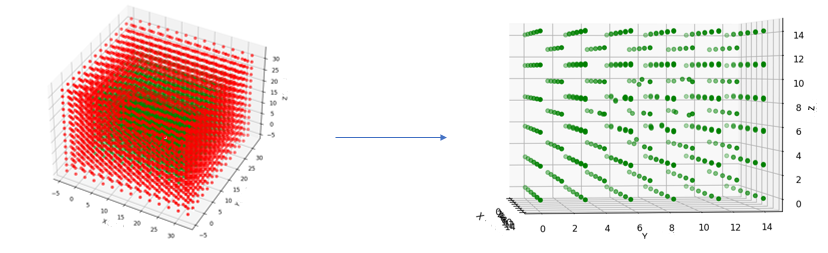

# Моделирование развития дефектов в кристаллических решётках с целью изучения свойств материалов

**Автор:** Попов Владимир Сергеевич, студент ИВТ ФРКТ МФТИ 
**Научный руководитель:** Наркевич Григорий Эдуардович, студент ФПМИ МФТИ

## Содержание
1. [Аннотация](#аннотация)
2. [Анализ рынка](#анализ-рынка)
   - [Аналоги](#аналоги)
3. [Цели и задачи](#цели-и-задачи)
4. [Ход работы](#ход-работы)
   - [Математическая модель](#математическая-модель)
   - [Проектирование](#проектирование)
   - [Результаты](#результаты)
5. [Перспективы развития](#перспективы-развития)
6. [Список литературы](#список-литературы)

## Аннотация

В наше время стремительно развиваются высокотехнологичные отрасли производства и науки: атомная энергетика, ядерная медицина, промышленное строительство. Во всех них требуется предельная точность и уверенность в работе высоконагруженных систем. На этапе проектирования нужно понимать поведение материалов на наноуровне, так как это напрямую сказывается на макропараметрах и свойствах материала.

Помимо этого, во всём мире растёт рынок новых материалов, экспериментальное изучение которых требует больших вложений (Рис. 1). Существует большая потребность в возможности моделирования развития кристаллических структур при определённых параметрах.



*Рисунок 1: Оценка мирового рынка полимерных композиционных материалов, млрд $*

Для решения вышеперечисленных проблем существует ряд программных пакетов, но чаще всего они либо больше не поддерживаются, либо имеют ограниченный функционал и неудобную организацию. Большинство из них также требуют от пользователя глубоких знаний компьютерных наук даже для банальной установки, что увеличивает неудобство использования и время подготовки для работы с программой.

При помощи созданного в данном проекте программного обеспечения можно будет понять поведение структуры кристаллической решётки вещества в заданной ситуации на наноуровне, получить качественные и количественные данные, а также тщательно изучить влияние всевозможных дефектов.

## Анализ рынка

Был рассмотрен ряд программных продуктов, и выявлен ряд минусов:
1. Высокий порог входа со стороны программных навыков;
2. Отсутствие регулярной поддержки разработчиками;
3. Неточности в расчётах;
4. Неудобство пользования и установки.

### Аналоги

#### LAMMPS

**Плюсы:**
- Большой функционал;
- Возможность установки дополнительных инструментов;
- Точность расчётов и моделирования.

**Минусы:**
- Неудобный интерфейс;
- Сложность в установке и использовании;
- Требует долгого освоения инструментов.

  
*Рисунок 2: Интерфейс программного пакета LAMMPS*

#### Diamond 3

**Плюсы:**
- Интуитивно понятный интерфейс;
- Простота использования;
- Понятная визуализация.

**Минусы:**
- Неточности в расчётах;
- Ограниченный функционал;
- Невозможность моделирования больших систем.

  
*Рисунок 3: Интерфейс программы Diamond 3*

## Цели и задачи

**Цель** – создать удобное программное обеспечение для математического моделирования развития кристаллических решёток материалов.

**Задачи:**
1. Изучить и проанализировать литературу по дефектообразованию, материаловедению и математическому моделированию;
2. Описать математическую модель развития кристаллической решётки;
3. Составить план программы и описать основные используемые методы;
4. Реализовать функциональные расчёты на языке программирования C++;
5. Создать инструмент визуализации на языке программирования Python;
6. Создать базу данных для связи компонентов программы;
7. Протестировать программу на проверенных экспериментальных данных;
8. Спроектировать и разработать полноценное веб-приложение;
9. Опробовать продукт в реальных условиях.

## Ход работы

### Математическая модель

#### Уравнение движения

Для того, чтобы понять, в какую сторону будут двигаться атомы, нужно составить для каждого из них уравнение движения (1). На данном этапе не будем учитывать неконсервативные и внешние силы, чтобы отладить работу программы. Это позволяет исключить из начальных данных скорости каждой частицы, которые сложно получить экспериментально с должной точностью.

$$
m \cdot \ddot{\overrightarrow{pos}} = \sum_{i=1}^{n}\Phi(r) (\overrightarrow{pos} - \hat{\overrightarrow{pos}}_i), \quad r \stackrel{\text{def}}{=} |\overrightarrow{pos} - \hat{\overrightarrow{pos}}_i|
$$

*Уравнение 1: $m$ - масса частицы, $\overrightarrow{pos}$ - положение частицы, $n$ - количество окружающих частиц, $\hat{\overrightarrow{pos}}_i$ - положение $i$-ой окружающей частицы, $r$ - расстояние между атомами, $\Phi(r)$ - поток массы*

В уравнении (1) поток массы рассчитывается из скалярной силы взаимодействия между парой атомов (2). Он же, в свою очередь, по определению равен производной попарного потенциала взаимодействия с противоположным знаком.

$$
\Phi(r) \stackrel{\text{def}}{=} \frac{F(r)}{r},\quad F(r) \stackrel{\text{def}}{=} -U'(r)
$$

*Уравнение 2: $F(r)$ - сила взаимодействия, $U(r)$ - потенциал взаимодействия*

#### Потенциал взаимодействия

В литературе используется большое количество разных потенциалов взаимодействия. Для нашего случая лучше всего подойдёт потенциал Морзе (3), так как он имеет 3 параметра, описывающих материал, что делает его адаптивным под моделируемый материал (в отличие от потенциала Ленарда-Джонса), при этом он не требует большого количества вычислений (в отличие от потенциала Ми), что значительно ускорит и так ресурсоёмкое моделирование.

$$
U(r) = D\left( e^{-2\alpha(r - r_e)} - 2e^{-\alpha(r-r_e)} \right)
$$
$$
F(r) = 2\alpha D\left(e^{-2\alpha(r - r_e)} - e^{-\alpha(r-r_e)} \right)
$$

*Уравнение 3: $D$ - глубина потенциальной ямы, $\alpha$ - ширина потенциальной ямы, $r_e$ - равновесное расстояние*

#### Интегрирование уравнения движения

Существует множество способов численного интегрирования уравнений движения. Одним из наиболее важных критериев является количество вычислений и требуемого объёма памяти. В связи с этим мы будем использовать алгоритм Верле (4), согласно которому вычисление следующего положения частицы осуществляется из двух предыдущих и ускорения частицы, которое мы научились рассчитывать выше.

$$
\overrightarrow{pos}(t + \tau) = 2 \cdot \overrightarrow{pos}(t) - \overrightarrow{pos}(t - \tau) + \vec{a}(t)\cdot\tau^2
$$

*Уравнение 4: $\tau$ - шаг интегрирования, $\vec{a}(t)$ - ускорение частицы*

На дальнейших этапах разработки программы планируется добавить режим расчёта при помощи метода Нордзика, который хоть и является менее точным на больших шагах интегрирования, показывает себя лучше алгоритма Верле на более маленьких.

### Проектирование

#### Архитектура программы

Все ресурсоёмкие вычисления будут выполняться на C++, поскольку он обеспечивает высокую скорость. Визуализация моделирования на данном этапе будет осуществляться при помощи Python и библиотеки matplotlib (на этапе тестирования возможен переход на библиотеку С++ Qt6).

Все компоненты будут связаны между собой базой данных и веб-интерфейсом (Рис. 4), но реализация этих частей программы будет осуществлена после отладки основного функционала.

  
*Рисунок 4: Схема связей компонентов всего программного обеспечения*

#### Моделирование

Функциональным ядром программы является часть кода на С++, поэтому рассмотрим его более детально. Составим план написания:
1. Создание кристаллита;
2. Реализация периодических граничных условий;
3. Разбиение на сферы Верле;
4. Интерфейс редактирования кристаллита;
5. Алгоритм моделирования;
6. Расчёт начальной и конечной энергии.

Сборка проекта осуществляется при помощи CMake в редакторе кода Visual Studio Code.

#### Хранение атомов

Для хранения координат атомов напишем структуру Coordinate:

```cpp
struct Coordinate {
    double x, y, z;
    
    Coordinate() noexcept : x(0.), y(0.), z(0.) {}
    Coordinate(double x, double y, double z) noexcept : x(x), y(y), z(z) {}
    
    bool operator==(const Coordinate &other) const noexcept;
    bool operator!=(const Coordinate &other) const noexcept;
    bool operator<(const Coordinate &other) const noexcept;
    Coordinate operator+(const Coordinate &other) const noexcept;
    Coordinate operator-(const Coordinate &other) const noexcept;
    Coordinate operator*(const Coordinate &other) const noexcept;
    Coordinate operator/(const Coordinate &other) const noexcept;
};
double Distance(const Coordinate &first, const Coordinate &second) noexcept;
```

Для того чтобы сэкономить в вычислительных расчётах определим класс Atom, в котором будем хранить указатель на Coordinate и массив указателей на координаты атомов сферы Верле данного. Сфера Верле определяет область радиуса, обычно равного двум равновесным расстояниям, внутри которой имеет смысл рассчитывать взаимодействие.

```cpp
class Atom {
   public:
    Atom(Coordinate *coor) noexcept : coor(coor) {}
    Atom(Coordinate *coor, std::vector<Coordinate *> verle) noexcept
        : coor(coor), verle(std::move(verle)) {}

    [[nodiscard]] const std::vector<Coordinate *> &Verle() const noexcept { return verle; }
    [[nodiscard]] std::vector<Coordinate *> &Verle() noexcept { return verle; }
    [[nodiscard]] Coordinate &Coor() noexcept { return *coor; }
    [[nodiscard]] const Coordinate &Coor() const noexcept { return *coor; }
    [[nodiscard]] Coordinate *PointerCoor() noexcept { return coor; }
    [[nodiscard]] const Coordinate *PointerCoor() const noexcept { return coor; }

    Coordinate SumOfFlows() const noexcept;
   private:
    Coordinate *coor;
    std::vector<Coordinate *> verle;
};
```

#### Элементарная ячейка

Помимо параметров моделирования пользователь будет задавать элементарную ячейку материала, из которой далее будет строиться сам кристалл. Для хранения этих данных напишем класс Cell.

```cpp
class Cell {
   public:
    Cell(std::vector<Coordinate> coordinates_vec, double x_size, double y_size, double z_size)
        : coordinates_vec(std::move(coordinates_vec)), x_size(x_size), y_size(y_size), z_size(z_size)
    {}
    Cell(std::vector<Coordinate> coordinates_vec, double size)
        : coordinates_vec(std::move(coordinates_vec)), x_size(size), y_size(size), z_size(size)
    {}

    [[nodiscard]] const std::vector<Coordinate>& CoordinatesVec() const noexcept
    { return coordinates_vec; }
    [[nodiscard]] std::vector<Coordinate>& CoordinatesVec() noexcept { return coordinates_vec; }
    [[nodiscard]] double XSize() const noexcept { return x_size; }
    [[nodiscard]] double YSize() const noexcept { return y_size; }
    [[nodiscard]] double ZSize() const noexcept { return z_size; }

   private:
    std::vector<Coordinate> coordinates_vec;
    double x_size, y_size, z_size;
};
```

#### Кристалл

Центром программы будет являться класс Crystal, в котором будут храниться координаты моделируемых атомов. Помимо моделируемой области также добавим массив атомов периодических граничных условий (ПГУ).

```cpp
class Crystal {
public:
    Crystal(const Cell& cell, long long x_size, long long y_size, long long z_size, double pgu_size);
    Crystal(const Cell& cell, long long size, double pgu_size)
        : Crystal(cell, size, size, size, pgu_size) {}
    void DeleteAtom(size_t index);
    void DeleteAtom(Coordinate atom);
    void AddAtom(Coordinate atom);
    void MoveAtom(Coordinate atom, Coordinate vector);
    void Modeling() {
        std::vector<Atom> cur_model(this->model);
        long long freq = 997;
        for (size_t i = 0; i < ITERATIONS_CNT; ++i) {
            std::vector<Atom> prev_model(std::move(cur_model));
            cur_model = this->model;
            for (size_t j = 0; j < cur_model.size(); ++j) {
                const Atom cur_position(cur_model[j]);
                const Atom prev_position(prev_model[j]);
                const Coordinate acceleration = cur_position.SumOfFlows() / MASS;
                this->model[j].Coor() = cur_position.Coor() * 2. - prev_position.Coor() +
                acceleration * TAU * TAU;
            }
            if (i % freq == 0) UpdateModelVerle();
            time += TAU;
        }
    }
    double Energy() const noexcept;
    //getters /**/
private:
    long long x_size, y_size, z_size, pgu_size;
    std::vector<Atom> model;
    std::vector<Coordinate*> pgu;
    std::vector<Coordinate> all;
};
```

#### Многопоточность

При больших объёмах модели программа будет выполняться долго даже с точки зрения реального времени, поэтому имеет смысл снизить константу при помощи средств многопоточного программирования.

```cpp
void Crystal::UpdateModelVerle() {
    std::array<std::future<void>, 8> tasks = {
        std::async(std::launch::async, &Crystal::UpdateModelVerleTh, this, 1),
        std::async(std::launch::async, &Crystal::UpdateModelVerleTh, this, 2),
        /*...*/
        std::async(std::launch::async, &Crystal::UpdateModelVerleTh, this, 8)};
}
void Crystal::UpdateModelVerleTh(long long num) {
    const size_t sz = this->model.size() / 8;
    const size_t start = sz * (num - 1), end = (num == 8 ? this->model.size() : num * sz);
    for (size_t i = start; i < end; ++i) {
        this->model[i].Verle().clear();
        FillVerle(this->model[i]);
    }
}
void Crystal::FillVerle(Atom &atom) {
    const Coordinate coor = atom.Coor();
    for (size_t i = 0; i < all.size(); ++i) {
        if (Distance(coor, all[i]) < R_VERLE && coor != all[i]) {
            atom.Verle().emplace_back(&all[i]);
        }
    }
}
```

#### Расчёт полной энергии

Полная энергия кристаллита рассчитывается из суммы всех попарных потенциалов для какого-либо атома (5). Благодаря этим данным мы можем понять энергию образования дефекта в моделируемом материале.

$$
E = \frac{1}{2}D\cdot\sum_{i}^{n}U(r_i)
$$

*Уравнение 5: Полная энергия кристаллита*

#### Визуализация

Python получает данные координат из внутренней базы данных, после парсит их в разные массивы и выводит при помощи matplotlib.

```python
import matplotlib.pyplot as plt

conf_cube = list(map(float, open('build/crystal.txt').read().split('\n')))
conf_PGU = list(map(float, open('build/pgu.txt').read().split('\n')))
xarr_cube, yarr_cube, zarr_cube, xarr_PGU, yarr_PGU, zarr_PGU = [], [], [], [], [], []

for i in range(0, len(conf_cube) - 2, 3):
    xarr_cube.append(conf_cube[i])
    yarr_cube.append(conf_cube[i + 1])
    zarr_cube.append(conf_cube[i + 2])
for i in range(0, len(conf_PGU) - 2, 3):
    xarr_PGU.append(conf_PGU[i])
    yarr_PGU.append(conf_PGU[i + 1])
    zarr_PGU.append(conf_PGU[i + 2])

fig = plt.figure()
ax = plt.axes(projection='3d')
ax.scatter(xarr_cube, yarr_cube, zarr_cube, color="green")
ax.scatter(xarr_PGU, yarr_PGU, zarr_PGU, color="red")
ax.set_xlabel('X')
ax.set_ylabel('Y')
ax.set_zlabel('Z')
plt.show()
```

### Результаты

В итоге наше программное обеспечение является инструментом, позволяющим моделировать различные конфигурации кристаллической решётки и кластера дефектов, создавать регулируемые периодические граничные условия, и в итоге моделировать развитие дефектов (Рис. 5).



*Рисунок 5: Визуализация результатов моделирования на примере 2-СМА дефекта в ОЦК решётке альфа-железа*

Для проверки правильности моделирования мы рассчитали энергию дефектообразования для классических случаев и сравнили с литературными данными. В таблице 1 представлены значения с полученной в ходе нашего исследования точностью.

| Показатели | Ед. изм. | Результат |
|------------|----------|-----------|
| Энергия образования 2-СМА дефекта в ОЦК решётке альфа-железа | эВ | 6.4 |
| Энергия образования вакансии в ОЦК решётке альфа-железа | эВ | 2.15 |
| Энергия образования вакансии в ГЦК решётке меди | эВ | 1.4 |

*Таблица 1: Результаты расчёта энергии дефектообразования*

Асимптотика всего моделирования зависит от параметров, среди которых количество атомов в решётке, толщина периодических граничных условий, количество атомов в сферах Верле. Если аппроксимировать все значения до одного параметра N, обозначающего количество атомов в моделируемом кристаллите, то временная сложность итогового алгоритма получится $O(N^2)$.

## Перспективы развития

1. Тестирование программы на предоставленных справочных данных для различных материалов;
2. Создание списка заготовленных конфигураций;
3. Расширение функционала добавления дефектов;
4. Реализация связи между компонентами через базу данных;
5. Создание веб-интерфейса;
6. Тестирование программы среди студентов и получение рецензий от специалистов;
7. Разработка бизнес-плана и выпуск коммерческого продукта.

## Список литературы

1. ЭКСПОЦЕНТР Москва. Современные технологии: [Электронный ресурс].  
   URL: https://www.expocentr.ru/ru/articles-of-exhibitions/17039/  
   (Дата обращения: 20.01.2022)
2. Команда BITOBE. Цикл зрелости технологий: [Электронный ресурс].  
   URL: https://blog.bitobe.ru/article/krivaya-gartnera/  
   (Дата обращения: 22.01.2022)
3. Буслаева Елена Михайловна. Классификация дефектов кристаллического строения: [Электронный ресурс].  
   URL: https://tech.wikireading.ru/16429  
   (Дата обращения: 25.01.2022)
4. Винтайкин Борис Евгеньевич. Физика твёрдого тела 6. Глава 2: Дефекты кристаллической решётки: [Электронный ресурс].  
   URL: http://fn.bmstu.ru/data-physics/library/physbook/tom6/ch2/texthtml/ch2_1.htm  
   (Дата обращения: 27.01.2023)
5. Минералогический музей им. А.Е. Ферсмана. Кристаллическая решётка: [Электронный ресурс].  
   URL: https://fmm.ru/Кристаллическая_решетка  
   (Дата обращения: 27.01.2022)
6. Плишкин Ю.М. Методы машинного моделирования в теории дефектов кристаллов  
   В кн.: Дефекты в кристаллах и их моделирование на ЭВМ. – Л.: Наука, 1980. С. 77–99.  
   (Дата обращения: 28.01.2022)
7. Богданова Ольга. Периодические граничные условия для системы частиц: [Электронный ресурс].  
   URL: http://tm.spbstu.ru/Периодические_граничные_условия_для_системы_частиц  
   (Дата обращения: 30.01.2023)
8. Баимова Юлия Айдаровна. Потенциалы межатомного взаимодействия: [Электронный ресурс].  
   URL: https://juliabaimova.com/uploads/s/7/o/8/7o8rncjqxa5m/file/fkwlWxK5.pdf?preview=1  
   (Дата обращения: 02.02.2022)
9. А.М. Кривцов, Н.В. Кривцова. Метод частиц и его использование в механике деформируемого твердого тела.  
   Опубликована в статье Дальневосточного математического журнала ДВО РАН, 2002, Т. 3, № 2, с. 254-276.  
   (Дата обращения: 27.10.2023)
10. С. В. Звонарев, В. С. Кортов, Т. В. Штанг. Моделирование структуры и свойств наносистем.  
    Издательство Уральского университета 2014.  
    (Дата обращения: 03.11.2023)
11. Куприянов Александр Викторович. Математическое моделирование, методы и программные средства текстурного анализа изображений кристаллических структур.  
    Автореферат диссертации на соискание научной степени доктора технических наук.  
    (Дата обращения: 25.11.2023)
